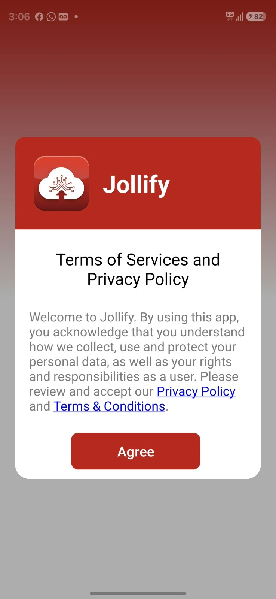
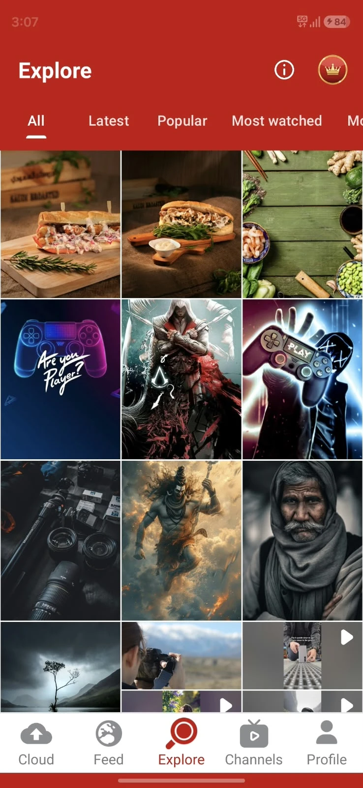
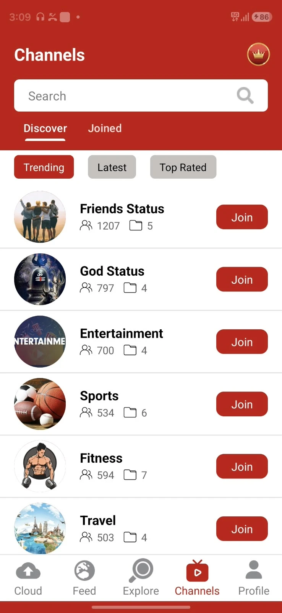
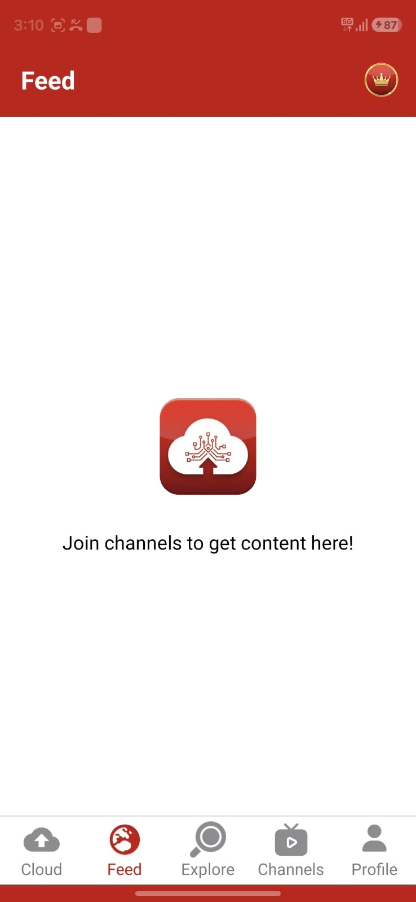
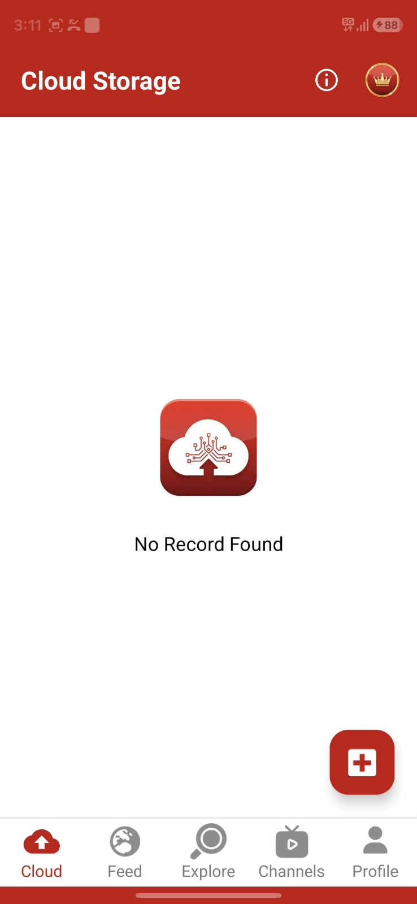

# Jollify App Flow Analysis

Screen-by-screen breakdown of the Jollify Android app, made from screenshots the
product owner provided. Screenshots are in [`reference/jollify/`](reference/jollify/).
This is a reference for **flow and features only**. Our app gets its own branding,
visual design, and text.

Batch 1: first launch + the 5 main tabs (empty/new-user state). More screens to follow.

---

## 0. Big picture

```
Install → Launch → [Consent dialog] → Agree → Explore tab (default)
                                                │
          ┌──────────┬──────────┬──────────────┼──────────┐
        Cloud       Feed      Explore       Channels    Profile
     (my files)  (joined    (public       (discover/   (TBD)
                  channels)  content)      join)
```

**Key finding:** Jollify behaves more like a **public content platform with
cloud storage attached** than a plain drive app. A new user lands on **Explore**
(public content), not on their own storage. Cloud is the first tab, but it is not
where the app opens. The content looks like Indian "WhatsApp status" material:
wallpapers, devotional images, short videos, and category channels such as
"Friends Status" and "God Status".

---

## 1. Consent dialog (first launch)



| Element | Detail |
|---|---|
| Trigger | First app open, before anything else |
| Background | Red gradient fading to grey (splash-like) |
| Card header | Red band with app icon (cloud + upload arrow + circuit lines) and app name |
| Title | "Terms of Services and Privacy Policy" |
| Body | Short paragraph saying that using the app means accepting how data is collected and used, with inline links to **Privacy Policy** and **Terms & Conditions** |
| Action | Single **Agree** button. No "Decline", no checkbox |
| Next | Goes straight to Explore. **No login/sign-up screen before content** |

Observations:
- No login is needed to browse, so the app offers **guest browsing**. Login is
  probably asked for only when the user uploads, joins a channel, or buys premium
  (to confirm with more screenshots).
- The consent screen asks for no device permissions; those come later, when needed.

What we will do differently:
- Add a "Decline / Exit" option and record when the user agreed and which policy
  version they agreed to (DPDP Act consent record).
- Open the policies in an in-app browser and show the policy version.
- Keep the one-tap "Agree" flow so onboarding stays quick.

---

## 2. Explore tab (default landing screen)



| Element | Detail |
|---|---|
| App bar | Red, title "Explore", **info (i)** icon, **gold crown** button (premium) |
| Tabs | Scrollable: **All · Latest · Popular · Most watched · Mo…** (more cut off) |
| Content | **3-column grid** of thumbnails. Images and videos mixed; videos have a **▶ badge** in the top-right corner |
| Grid style | Rows can have different heights. Some cells in the last visible row are stacked, which suggests a mosaic/staggered layout |
| Content type | Food photos, gaming wallpapers, devotional art, portraits, landscapes, short vertical videos |
| Bottom nav | Cloud · Feed · **Explore (active, red)** · Channels · Profile |

Inferred behaviour:
- Explore shows a mix of **public posts from all public channels**.
- Sort tabs need per-post stats: `created_at` (Latest), likes/engagement (Popular),
  `view_count` (Most watched).
- Tapping a tile probably opens a full-screen viewer (image/video) with actions
  such as download, share (WhatsApp), and like (to confirm).
- The **info (i)** icon probably explains the screen or shows app info / storage
  info (to confirm).
- The **crown** shows on every tab, so the premium paywall is always one tap away.

---

## 3. Channels tab



| Element | Detail |
|---|---|
| App bar | "Channels" + crown (no info icon here) |
| Search | Full-width white search field with a search icon, inside the red header |
| Tabs | **Discover** (active) · **Joined** |
| Filter chips | **Trending** (selected, red) · Latest · Top Rated (grey) |
| List row | Circular channel avatar · channel name (bold) · 👥 **member count** · 📁 **folder count** · red **Join** button |
| Example channels | Friends Status (1207 👥, 5 📁), God Status (797, 4), Entertainment (700, 4), Sports (534, 6), Fitness (594, 7), Travel (503, 4) |

Inferred behaviour:
- A channel holds **folders** (albums), and folders hold media posts. So the
  structure is **Channel → Folder → Media**.
- The member counts are small and the channel names are generic categories, which
  suggests the **platform seeded these channels** (made by admins) to solve the
  empty-content problem at launch.
- Joining a channel puts its content in the **Feed**. Members can upload content to
  the channel publicly, per the product owner.
- "Top Rated" means channels have ratings or a score.
- "Joined" lists the channels the user is in. Users probably can create their own
  channels as well (to confirm; no create button is visible on this screen).

---

## 4. Feed tab



| Element | Detail |
|---|---|
| App bar | "Feed" + crown |
| Empty state | App icon + "Join channels to get content here!" |
| Purpose | Newest posts from the channels the user has joined |

What we will do differently:
- Put a **"Discover channels"** button in the empty state that opens Channels → Discover.
- Show suggested channels inline, so a new user's feed is never blank.

---

## 5. Cloud Storage tab (personal drive)



| Element | Detail |
|---|---|
| App bar | "Cloud Storage" + info (i) + crown |
| Empty state | App icon + "No Record Found" |
| FAB | Red rounded-square **+** button, bottom right, for upload / create folder |
| Missing in empty state | No storage meter, no explanation of the free 1 TB, no folder shortcuts |

Inferred behaviour:
- The + button probably opens a sheet: upload photos, videos, or files, or create a
  folder (to confirm with more screenshots).
- The info icon probably shows the storage quota / used space (to confirm).

What we will do differently:
- A helpful empty state: "You have 1 TB free. Upload your first file", with buttons
  for "Back up photos" and "Upload files".
- A storage meter always visible at the top.
- Quick filters: Photos · Videos · Docs · Others.

---

## 6. Visual design notes (reference only)

| Token | Observation |
|---|---|
| Primary | Strong red (~`#B3261E`), used for app bar, buttons, active nav, FAB |
| Premium accent | Gold crown in a red circle with a gold ring |
| Surfaces | White content area; grey inactive chips |
| Bottom nav | 5 items, icon + label; active = red, inactive = grey |
| Typography | Bold large titles in the app bar (Roboto-like) |
| Empty states | App icon + one line of text, centred |

Our app will use its **own** colors, icon, and naming. These notes record the
layout patterns only.

---

## 7. Impact on our plan

1. **Social content is core, not a later phase.** The app opens on Explore and
   three of the five tabs (Feed, Explore, Channels) are social. Proposal: move
   Channels / Explore / Feed into the MVP, alongside basic cloud storage.
   _Decision pending: see [open questions](05-open-questions.md)._
2. **Guest mode:** allow browsing without an account; require login to upload,
   join, post, or buy.
3. **Content structure:** Channel → Folder → Media. Update the data model
   (add `channel_folders`; posts belong to a folder).
4. **Engagement stats:** add view counts, likes, and channel ratings to support
   Latest / Popular / Most watched / Trending / Top Rated sorting.
5. **Seed content at launch:** admins create category channels and fill them with
   licensed or original content. This means the admin panel and moderation must
   be ready at launch.
6. **Moderation from day one:** public uploads go to members right away, so
   reporting, NSFW checks, and takedown tools are launch requirements.
7. **Premium entry point (crown)** on every tab's app bar.

---

## 8. Still unknown (need more screenshots)

- [ ] Login / sign-up screen and when it appears
- [ ] Profile tab
- [ ] Explore → tap a tile (viewer, actions: download, share, like?)
- [ ] Channel detail page → folders → media; how members upload
- [ ] Create-channel flow (if users can create channels)
- [ ] Cloud: + button sheet, folder view, file viewer, share link
- [ ] Info (i) screen
- [ ] Premium / crown paywall and plan list
- [ ] Settings, delete account
- [ ] Ads: where and what type (banner, interstitial, rewarded)
