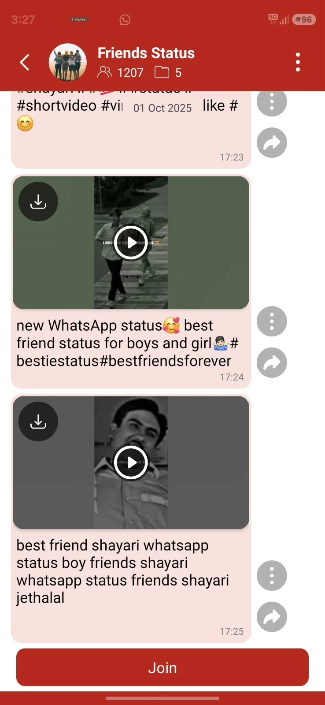
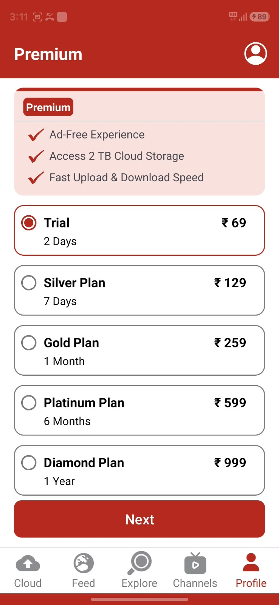
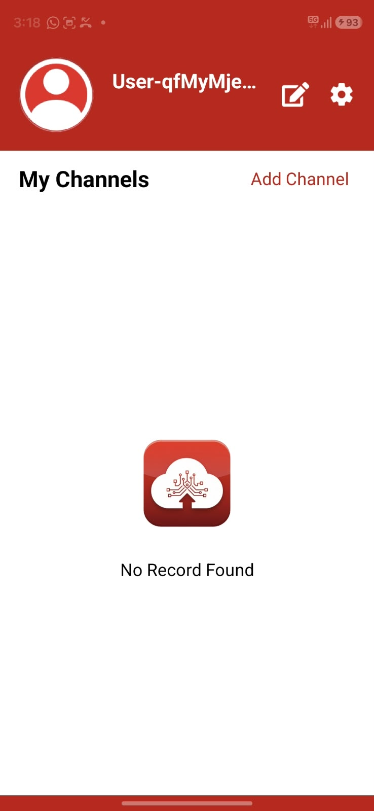
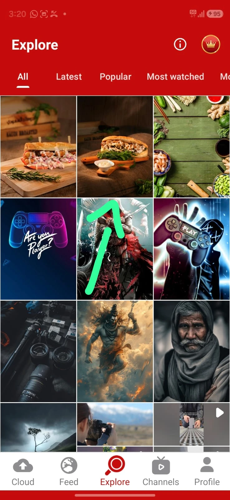
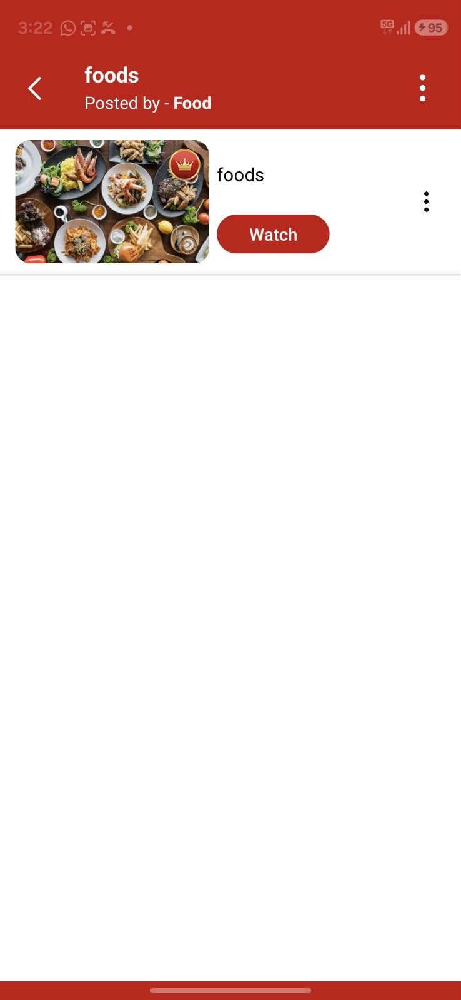
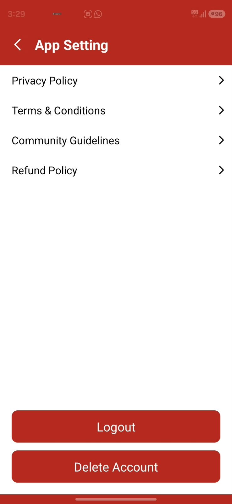

# Jollify App Flow Analysis

Screen-by-screen breakdown of the Jollify Android app, made from screenshots the
product owner provided. Screenshots are in [`reference/jollify/`](reference/jollify/).
This is a reference for **flow and features only**. Our app gets its own branding,
visual design, and text.

- Batch 1: first launch + the 5 main tabs (empty/new-user state)
- Batch 2: Profile tab (Premium plans), user profile, Explore → content detail → Watch
- Batch 3: Channel detail page, App Settings, Cloud + button gate

More screens to follow.

---

## 0. Big picture

```
Install → Launch → auto-create GUEST account → [Consent dialog] → Agree → Explore (default)
                                                                          │
     ┌──────────────┬───────────────┬───────────────────┬────────────────┴───┐
   Cloud           Feed          Explore             Channels            Profile
 (my files)     (joined        (all public          (discover/          = Premium plans
                 channels)      channel posts)       join)                 └─ 👤 icon → User profile
                                   │                                         (name, edit, settings,
                                   ▼                                          My Channels, Add Channel)
                           Content detail (collection)
                                   │ Watch (premium item)
                                   ▼
                           Premium plans → Next → Login (Email / Google) → (payment: later)

Other gates that lead to the same place:
  Channels → channel page → Join        → Login required
  Channel page → ▶ play                 → Premium plans
  Cloud → +  (upload)                   → Premium plans
  Profile → Add Channel                 → Login required
```

**Key findings:**

1. **Everyone starts as a guest.** On first open the app silently creates a guest
   account (random name like `User-qfMyMje…`). Real login (Email or Google) is asked
   for only when the user picks a paid plan (and before creating a channel).
2. **Channels feed Explore.** Anything posted to a public channel automatically
   shows in Explore. Explore is the combined view of all channel content.
3. **Content is the paywall.** Free users can browse thumbnails, but tapping
   **Watch** on premium (👑) content sends them to the plans page. This is the main
   way the app makes money, more than storage.
4. **Almost every action is gated.** Free users (guest or logged in) can only
   **browse thumbnails and captions**. Playing content and uploading to Cloud both
   need a plan; joining or creating a channel needs login. See the access matrix in §5f.
5. Jollify behaves more like a **public content platform with
cloud storage attached** than a plain drive app. A new user lands on **Explore**
(public content), not on their own storage. Cloud is the first tab, but it is not
where the app opens. The content looks like Indian "WhatsApp status" material:
wallpapers, devotional images, short videos, and category channels such as
"Friends Status" and "God Status".

---

## 1. Consent dialog (first launch)


| Element | Detail |
|---|---|
| Trigger | First app open, before anything else |
| Background | Red gradient fading to grey (splash-like) |
| Card header | Red band with app icon (cloud + upload arrow + circuit lines) and app name |
| Title | "Terms of Services and Privacy Policy" |
| Body | Short paragraph saying that using the app means accepting how data is collected and used, with inline links to **Privacy Policy** and **Terms & Conditions** |
| Action | Single **Agree** button. No "Decline", no checkbox |
| Next | Goes straight to Explore. **No login/sign-up screen before content**: a guest account is created automatically |

Observations:
- No login is needed to browse: a **guest account is auto-created** (confirmed in
  batch 2). Email/Google login is asked for when buying a plan or adding a channel.
- The consent screen asks for no device permissions; those come later, when needed.

What we will do differently:
- Add a "Decline / Exit" option and record when the user agreed and which policy
  version they agreed to (DPDP Act consent record).
- Open the policies in an in-app browser and show the policy version.
- Keep the one-tap "Agree" flow so onboarding stays quick.

---

## 2. Explore tab (default landing screen)


| Element | Detail |
|---|---|
| App bar | Red, title "Explore", **info (i)** icon, **gold crown** button (premium) |
| Tabs | Scrollable: **All · Latest · Popular · Most watched · Mo…** (more cut off) |
| Content | **3-column grid** of thumbnails. Images and videos mixed; videos have a **▶ badge** in the top-right corner |
| Grid style | Rows can have different heights. Some cells in the last visible row are stacked, which suggests a mosaic/staggered layout |
| Content type | Food photos, gaming wallpapers, devotional art, portraits, landscapes, short vertical videos |
| Bottom nav | Cloud · Feed · **Explore (active, red)** · Channels · Profile |

Inferred behaviour:
- Explore shows a mix of **public posts from all public channels**.
- Sort tabs need per-post stats: `created_at` (Latest), likes/engagement (Popular),
  `view_count` (Most watched).
- Tapping a tile probably opens a full-screen viewer (image/video) with actions
  such as download, share (WhatsApp), and like (to confirm).
- The **info (i)** icon probably explains the screen or shows app info / storage
  info (to confirm).
- The **crown** shows on every tab, so the premium paywall is always one tap away.

---

## 3. Channels tab


| Element | Detail |
|---|---|
| App bar | "Channels" + crown (no info icon here) |
| Search | Full-width white search field with a search icon, inside the red header |
| Tabs | **Discover** (active) · **Joined** |
| Filter chips | **Trending** (selected, red) · Latest · Top Rated (grey) |
| List row | Circular channel avatar · channel name (bold) · 👥 **member count** · 📁 **folder count** · red **Join** button |
| Example channels | Friends Status (1207 👥, 5 📁), God Status (797, 4), Entertainment (700, 4), Sports (534, 6), Fitness (594, 7), Travel (503, 4) |

Inferred behaviour:
- A channel holds **folders** (albums), and folders hold media posts. So the
  structure is **Channel → Folder → Media**.
- The member counts are small and the channel names are generic categories, which
  suggests the **platform seeded these channels** (made by admins) to solve the
  empty-content problem at launch.
- Joining a channel puts its content in the **Feed**. Members can upload content to
  the channel publicly, per the product owner.
- "Top Rated" means channels have ratings or a score.
- "Joined" lists the channels the user is in. Users probably can create their own
  channels as well (to confirm; no create button is visible on this screen).

---

## 3a. Channel detail page



Opened by tapping a channel in the Channels list. It looks and works like a
**Telegram channel**: a chat-style stream of posts.

| Element | Detail |
|---|---|
| App bar | Back ←, round channel avatar, **"Friends Status"**, 👥 1207 · 📁 5, ⋮ menu |
| Post stream | Chat-style **pink bubbles**, newest at the bottom |
| Date chip | Centred date separator, e.g. "01 Oct 2025" |
| Post bubble | Video thumbnail with a centred ▶ **play** button and a ⬇ **download** button (top-left, dark circle); caption with emojis and hashtags; time (17:23, 17:24, 17:25) bottom-right |
| Side actions | Round grey buttons next to each bubble: ⋮ (more) and ↪ **share/forward** |
| Bottom CTA | Full-width red **Join** button (user hasn't joined yet) |

Behaviour (per the product owner):
- **Join → login required** (guests are sent to Email/Google sign-in).
- **▶ Play → premium plan required.** Premium users play the content **online in an
  in-app player** (streaming).
- The 📁 folder count suggests posts are grouped into folders, probably opened
  from the ⋮ menu (not seen yet).

Observations:
- Captions are keyword/hashtag-heavy ("new WhatsApp status… #bestiestatus…"),
  typical of clips re-uploaded from YouTube/Instagram.
- Posts are sent by the channel itself (no per-post author shown), which looks like
  the Telegram "broadcast channel" model: the owner/admins post and members watch.

---

## 4. Feed tab


| Element | Detail |
|---|---|
| App bar | "Feed" + crown |
| Empty state | App icon + "Join channels to get content here!" |
| Purpose | Newest posts from the channels the user has joined |

What we will do differently:
- Put a **"Discover channels"** button in the empty state that opens Channels → Discover.
- Show suggested channels inline, so a new user's feed is never blank.

---

## 5. Cloud Storage tab (personal drive)


| Element | Detail |
|---|---|
| App bar | "Cloud Storage" + info (i) + crown |
| Empty state | App icon + "No Record Found" |
| FAB | Red rounded-square **+** button, bottom right, for upload / create folder |
| Missing in empty state | No storage meter, no explanation of the free 1 TB, no folder shortcuts |

Inferred behaviour:
- The + button probably opens a sheet: upload photos, videos, or files, or create a
  folder (to confirm with more screenshots).
- The info icon probably shows the storage quota / used space (to confirm).

What we will do differently:
- A helpful empty state: "You have 1 TB free. Upload your first file", with buttons
  for "Back up photos" and "Upload files".
- A storage meter always visible at the top.
- Quick filters: Photos · Videos · Docs · Others.

---

## 5a. Profile tab = Premium plans page



Tapping **Profile** in the bottom nav does **not** open the profile. It opens the
**Premium** plans page. The real profile is behind the 👤 icon in the top-right
(screenshot 07).

| Element | Detail |
|---|---|
| App bar | "Premium" + 👤 **profile icon** (top-right) |
| Benefits card | Pink card with a "Premium" badge and 3 ticks: **Ad-Free Experience · Access 2 TB Cloud Storage · Fast Upload & Download Speed** |
| Plan list | Radio-button cards, **Trial pre-selected** (red border) |
| Plans | Trial **₹69 / 2 days** · Silver **₹129 / 7 days** · Gold **₹259 / 1 month** · Platinum **₹599 / 6 months** · Diamond **₹999 / 1 year** |
| CTA | Full-width red **Next** button |
| Next → | Login (Email or Google) if still a guest → payment (integration deferred) |

Observations:
- The search snippet said Diamond was ₹899. The app now shows **₹999**, so they
  change prices from time to time (or ran a discount). Prices must be
  **configurable from the admin panel**, not hard-coded.
- The benefits say premium gets **2 TB**, so **free users get 1 TB** (the website headline).
- The perks listed are only 3: no ads, more storage, speed. Unlocking 👑 content is
  **not listed**, but it is what the Watch button actually sells (see 5c).
- No per-day price, "most popular" tag, or savings label. Easy wins for us.
- Not visible: whether plans auto-renew. The fixed short terms (2 days, 7 days)
  suggest **one-time prepaid passes** rather than auto-renewing subscriptions.

## 5b. User profile (from the 👤 icon)



| Element | Detail |
|---|---|
| Header | Red band, large round avatar, display name **`User-qfMyMje…`** (auto-generated guest name), ✏️ **edit**, ⚙️ **settings** |
| Section | **My Channels** + **Add Channel** link (top-right) |
| Empty state | App icon + "No Record Found" |
| Navigation | Pushed screen; **no bottom nav** on this page |

Behaviour (per the product owner):
- ✏️ lets the user change their name (and probably the avatar).
- "My Channels" lists the channels the user has **joined** (and probably those they own).
- **Add Channel requires login**, so guests are sent to Email/Google sign-in first.
- ⚙️ Settings: not seen yet.

## 5c. Explore → Content detail → Watch

 

Tapping a tile in Explore opens a **content detail page**, not a full-screen viewer.

| Element | Detail |
|---|---|
| App bar | Back ←, title **"foods"** (post/collection name), subtitle **"Posted by - Food"** (channel name), ⋮ menu |
| Item row | Rounded thumbnail with a **👑 crown badge** (premium item), title "foods", red **Watch** button, row ⋮ menu |
| Watch | Opens the **Premium plans** page (5a) when the user is not premium |

Inferred behaviour:
- An Explore tile is a **post/collection** from a channel, which can hold one or more
  items. Each item can be **free or premium (👑)**.
- **Watch** checks the user's entitlement: premium → play/view; otherwise → paywall.
- The ⋮ menus probably hold Report / Share / Download / Save to Cloud (to confirm).
- So the paywall shows up whenever a free user hits premium content, which is the
  main money-maker.

---

## 5d. App Settings (⚙️ on the user profile)



| Element | Detail |
|---|---|
| App bar | Back ←, "App Setting" |
| List | **Privacy Policy › · Terms & Conditions › · Community Guidelines › · Refund Policy ›** |
| Buttons | Full-width red **Logout** and **Delete Account** at the bottom |

Observations:
- Settings has only legal links + logout/delete. No notifications, language, cache,
  theme, backup, or help/contact options.
- **Logout** is shown even for guests. For a guest, logging out would lose the
  account. We should hide it (or warn) for guests.
- **Delete Account** is in-app, as Google Play requires (flow not seen yet).

What we will do differently:
- Add: Account (email, linked Google), Notifications, Language, Clear cache,
  Help & Support / Contact, About (version), and the grievance officer contact
  (IT Rules 2021).
- Confirmation + 30-day grace period on delete.

## 5e. Cloud "+" button

Per the product owner: tapping **+** in Cloud Storage opens the **Premium plans**
page for non-premium users. **Free users cannot upload at all.**

Observations:
- The website headline "1 TB free cloud storage" is not usable by free users. The
  app only lets premium users upload, and premium is advertised as 2 TB.
- **Decision:** we copy this behaviour. Cloud upload is premium-only.

## 5f. Access matrix (Jollify, as observed)

| Action | Guest | Logged in, no plan | Premium |
|---|---|---|---|
| Browse Explore, Channels, Feed (thumbnails, captions) | ✅ | ✅ | ✅ |
| Open a post / channel page | ✅ | ✅ | ✅ |
| Edit display name | ✅ | ✅ | ✅ |
| Join a channel | 🔒 login | ✅ | ✅ |
| Add (create) a channel | 🔒 login | ✅ | ✅ |
| ▶ Play / Watch content (online player) | 💎 plan | 💎 plan | ✅ |
| ⬇ Download content | 💎 plan (assumed) | 💎 plan (assumed) | ✅ (to confirm) |
| Upload to Cloud (+) | 💎 plan | 💎 plan | ✅ up to 2 TB |
| Ads | Shown (assumed) | Shown (assumed) | None |

🔒 = sent to Email/Google login · 💎 = sent to the Premium plans page (buying a plan
also requires login first).

---

## 6. Visual design notes (reference only)

| Token | Observation |
|---|---|
| Primary | Strong red (~`#B3261E`), used for app bar, buttons, active nav, FAB |
| Premium accent | Gold crown in a red circle with a gold ring |
| Surfaces | White content area; grey inactive chips |
| Bottom nav | 5 items, icon + label; active = red, inactive = grey |
| Typography | Bold large titles in the app bar (Roboto-like) |
| Empty states | App icon + one line of text, centred |

Our app will use its **own** colors, icon, and naming. These notes record the
layout patterns only.

---

## 7. Impact on our plan

1. **Social content is core, not a later phase.** The app opens on Explore and
   three of the five tabs (Feed, Explore, Channels) are social. Proposal: move
   Channels / Explore / Feed into the MVP, alongside basic cloud storage.
   _Decision pending: see [open questions](05-open-questions.md)._
2. **Guest mode:** allow browsing without an account; require login to upload,
   join, post, or buy.
3. **Content structure:** Channel → Folder → Media. Update the data model
   (add `channel_folders`; posts belong to a folder).
4. **Engagement stats:** add view counts, likes, and channel ratings to support
   Latest / Popular / Most watched / Trending / Top Rated sorting.
5. **Seed content at launch:** admins create category channels and fill them with
   licensed or original content. This means the admin panel and moderation must
   be ready at launch.
6. **Moderation from day one:** public uploads go to members right away, so
   reporting, NSFW checks, and takedown tools are launch requirements.
7. **Premium entry point (crown)** on every tab's app bar.

---

### Added after batch 2

8. **Guest-first auth.** Create an anonymous account on first launch (device-bound
   token, random display name). Upgrade it **in place** to an Email/Google account on
   purchase or channel creation, so joined channels, uploads, and settings are kept.
9. **Premium content.** Each media item gets an `is_premium` flag. Watch / download
   checks the user's entitlement on the server; free users get the paywall. Thumbnails
   stay public so Explore still looks full.
10. **Plans as one-time passes** (2 d / 7 d / 1 m / 6 m / 1 y), with prices and perks
    editable in the admin panel. Free = 1 TB, Premium = 2 TB.
11. **Profile tab opens the paywall.** We can copy this placement, but should make
    the profile easier to find (e.g. Profile tab → profile, with a big "Go Premium"
    card at the top). Final call is the product owner's.
12. _(Removed: content-rights review is out of scope for the tester build.)_

### Added after batch 3

13. **Channel page = Telegram-style post stream** (bubbles, date chips, per-post
    play/download/share/more, Join bar). The Flutter UI should be built as a chat-like
    list, and the API should return posts newest-first with cursor pagination.
14. **Streaming player for premium users.** Videos are transcoded to HLS; the player
    requests a short-lived signed playlist URL only after the server confirms the
    user is premium.
15. **Feature gating in one place.** One server-side entitlement check
    (`guest` / `free` / `premium`) used by Join, Play, Download, Upload, and Add
    Channel, plus a client-side "gate" helper that shows the login sheet or the
    plans page. Gate rules should be configurable (e.g. let free users upload a
    small amount later without an app update).
16. **Settings** needs more than legal links (see 5d), and Logout must be hidden or
    guarded for guest accounts.
17. **Payments are out of scope for now** (product owner's decision). The plans page,
    login gate, and entitlement checks will be built first; payment integration
    comes later. For testing, premium can be granted from the admin panel.

---

## 8. Still unknown (need more screenshots)

- [x] ~~Login / when it appears~~: guest auto-login; Email/Google at plan purchase or Add Channel
- [x] ~~Profile tab~~: opens Premium; 👤 → user profile
- [x] ~~Explore → tap a tile~~: content detail with Watch
- [x] ~~Premium / crown paywall and plan list~~
- [ ] Login screen itself (Email + Google buttons, OTP? password?)
- [x] ~~What premium users see after Watch~~: content plays online in an in-app player
- [ ] The player screen itself (controls, next/previous, download, share)
- [ ] Free (non-👑) content: what Watch does
- [x] ~~Channel detail page~~: Telegram-style stream, Join → login, Play → plan
- [ ] Channel ⋮ menu, folder view, how owners/members post; who can mark content premium
- [ ] Channel page after joining (does Join become a message/upload bar?)
- [ ] Add Channel form
- [x] ~~Settings (⚙️)~~: legal links + Logout + Delete Account
- [ ] Edit profile screen, delete-account confirmation flow
- [x] ~~Can guests upload?~~: no, + opens the plans page for all non-premium users
- [ ] Cloud for premium users: + sheet, folder view, file viewer, share link
- [ ] Info (i) screen
- [ ] Ads: where and what type (banner, interstitial, rewarded)
